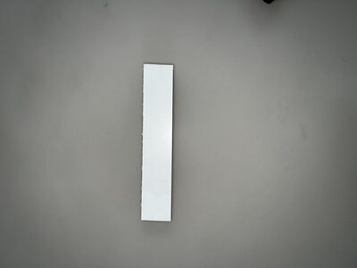
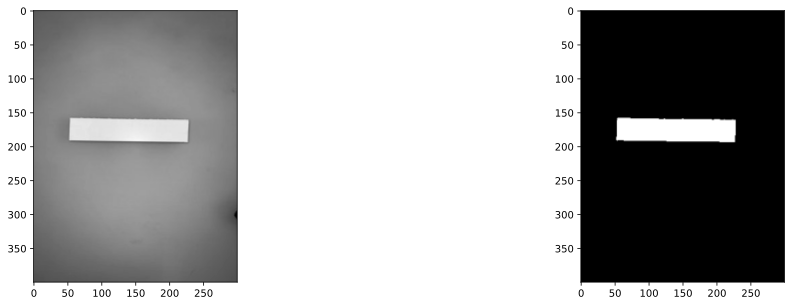
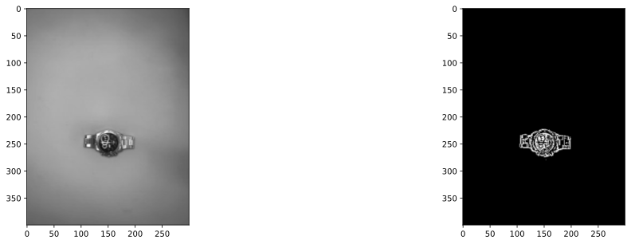

# [Image_Processing] Object_Dimension_Calculation
A couple of week ago, I saw a video of a new computer vision tool. It's main functionality was to have an estimate of the size of a given object.  
This notebook is aimed to have an introduction on this new system and a possible way of calculating the dimensions of an object in a still photograph.

##  Image Setup:
A very important consideration when applying this approach, is the need of a background that will create a high contrast with the object. Good lightning is also a critical component to ensure the program creates the correct differentiation in the image.  
On a "real-life" scenario, it is vital that the camera has a defined distance from the object. Due to the fact that pixels will be used to determine the length of the object. If the camera is closer or further away than the control image, the meassurement will be incorrect. 

## Calibration Image:
To implement this solution, a calibration need to be done to calculate the ratio between centimeters and pixels. To do so, we will take the next object for calibration

As it can be observed, the gray background creates a good contrast with the object.  
To count the number of pixels that represent the object in the image, a binary image will be created. To do so, a binary threshold will be applied. This will create a black and white image that will be easier to manipulate and use.   
 
After applying the binary threshold, the next image is obtained: 

A white body is created by all the pixels that represent the object. To calculate the height and length of an object, we need to count the number of pixels from one edge to another. The control image is a perfect rectangle; however, not all objects will have regular edges. To ensure a correct approximation of the dimensions, the first and last white pixels along the X axis will be considered to calculate the length. After having the indexes of both, a simple substraction will be done to calculate the total ammount of pixels that represent the length. This same process will be applied to calculate the height. After the control object is meassured we have the following values:  
$Length: 175 px$  
$Height: 35px$  

As the actual length of the control object is known, the ration between cm and pixels can be calculated. The object has a length of 175 pixels and a real value of 17.5cm; hence: 

$17.5cm = 175px \to 1cm = \frac{175}{17.5} \to 1cm = 10px$  

With the ratio already calculated, this same process is applied to the test images.

$Length: 9.4cm$  
$Height: 5.6cm$  

## Considerations: 
While this is an approximation for the rough meassurements, this approach can be applied to different scenarios where an object must be packed. This scenarios can be such as mail services, warehouse storage and packaging to mention a few. This implementation is done on still photographs, but can be applied to live video. 
